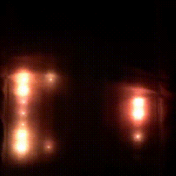
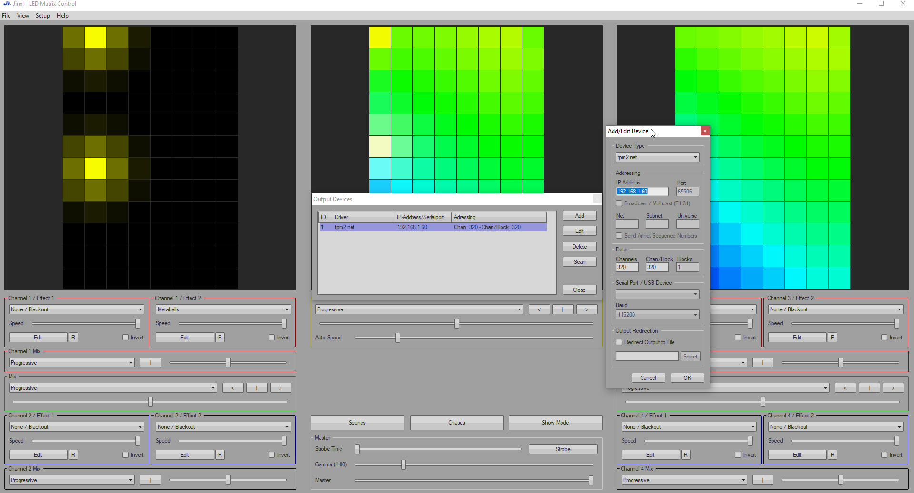
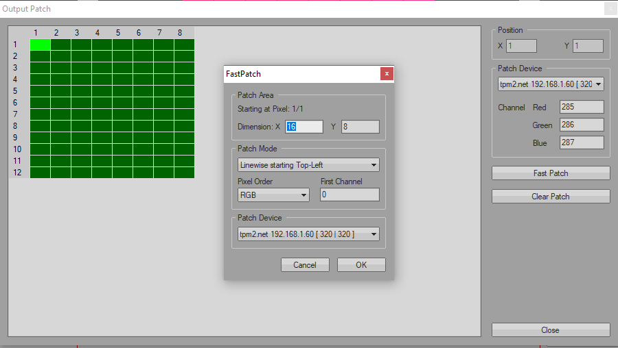

# Poor man's NeoPixel shirt board

I do this project to try using NeoPixel LED strip for "illuminate shirt". The idea is, put NeoPixels on the neck-hanging oversized card, connect to network and drive LEDs using ESP8266, and control with whatever program that support TPM2.net ([Jinx](https://www.ledstyles.de/index.php?thread/22271-jinx-led-matrix-control-und-die-n%C3%A4chste-matrix-software/) for example) just for fun.

## What the hell are you doing.

My company have an outing party with "Neon" theme. At first, I'd like to use some funky "EL Wire", or even [electroluminiscent shirt](https://www.youtube.com/watch?v=eUUupR-ongs). But, when I check the price, I've to abandon that idea. At the same time, I see [Andreas Spiess's video about NeoPixel](https://www.youtube.com/watch?v=IIl5nDjfkjY). So, I do this project instead.

In this project, I put a 8x12 NeoPixel LEDs matrix on the wooden board, tie with a neck lanyard, hang the board inside a white T-shirt (to hide the eyesore wiring and make the light diffuse),  connect with ESP8266 to drive those LEDs, and use Jinx to make the shirt look like the shirt is illuminated.

## Resources needed to use

### Hardware

- ESP8266-06 (The greater version should be fine to use. I've this model laying around so I use it 🤷‍♂️)
- FTDI (Or any (?) USB to UART converter that support 3.3v logic level)
- NeoPixel LED strip. (Of course) I buy [this model from AliExpress](https://www.aliexpress.com/item/32682015405.html).
- Misc. electronic components. (See in [Hardwares/BOM.csv](./Hardwares/BOM.csv) for more, specific detail)
- Power supply. I use 2A-capable output powerbank since the strip use 5V power.
- Platform. I use an A4-szie processed wooden board because it's fit for the job (Easy to drill and attach LED strip, not too heavy, and CHEAP! I buy from the local stationery shop for ~ ¢30 )

### Software

- Sketch developing
	* Arduino (or VSCode with PlatformIO if you prefer)
	* ESP8266 developer SDK
	* 3rd party
		+ [FastLED](https://github.com/FastLED/FastLED) for LED driving. You can use Adafruit_NeoPixel if you like.
		+ [ESPAsyncUDP](https://github.com/me-no-dev/ESPAsyncUDP) for UDP packet handling.
- LED matrix controlling
	* [Jinx](http://www.live-leds.de/downloads/) for a comprehensive LED controlling via PC. Or,
	* Any application that can transmit UDP packet that comply TPM2.net protocol

## Setup

### Hardware

I've just combine a logic level converter using 2N7000 N-Channel E-mode MOSFET ([detail](https://www.hobbytronics.co.uk/mosfet-voltage-level-converter)), a resouvior capacitor to protect LEDs from voltage spike and current limiting resistor to protect data pin from overcurrent (I adapt from [Adafruit article](https://learn.adafruit.com/adafruit-neopixel-uberguide/powering-neopixels)), and FTDI female pin header along with reset and flash enable buttons for flashing new firmware (I didn't put pull-up resistor for buttons, which you should, due to lack of board's space (and my laziness)). Since it have a few elements to put it together, I create a board using a remaining peice of perfboard from another project. It should took less than 1 hour to soldering it together.

If you use a seperate 3.3v regulator, you can get rid a voltage divider and use a pull-up resistor instead.

However, due to high current used by LEDs when fully display, make sure you use big enough wire gauge to prevent short circuit.

If you want to see the schematic, [here it is](./Hardware/Schematic.pdf).

### Software

#### Flashing sketch

There're 2 sketchs in this project:

- [`jinx_debug`](./sketches/jinx_debug) is for debugging TMP2.net data stream from Jinx (or wherever that may be) if you want to see the packet in action or check wheter the data is correctly transmit. When a packet's transmit, `Serial` will show each of data in TPM2.net structure which I'll describe below.

- [`jinx_fastled`](./sketches/jinx_fastled) is an actual firmware used in the project. When it start and try to connecting to a designate Wi-Fi network, LEDs will illuminate according to time used for connection attemp and clear when the connection is established. And, of course, display LEDs sequence according to packet stream.

Before flash a sketch you want, make sure that:

- You change SSID and password of a Wi-Fi to use.
- If you change a data pin, make sure you change `PIN` to a *GPIO* pin number.
- Reset ESP module to flash mode (*HOLD* EN, *PUSH* RESET, *RELEASE* EN).

### Jinx setup

If you want to use Jinx to control LEDs display:

- Download and install the software (it don't need administrative priviledge 😉)
- Go to `Setup` > `Matrix options`. Then, in `matrix diemnsion`, edit the matrix size to match with yours.
- Go to `Setup` > `Output devices`. Click `Add`. Then, fill the form as following:
	
	* *Device type*: `tpm2.net`
	* *IP Address*: Check your router. Or, if you attach FTDI, see the line `IP Address: ` in the `Serial` console.
	* *Data > Channels* & *Chan/Block*: __At lease__ (3 * width * height) + 7. Each pixel need 3 bytes (Red, Green, Blue), 7 bytes is for *TPM2.net* prefix and end byte. Jinx will send data as a user data and raw bytes of pixels. Excess bytes'll be ignored by default. And, since I'm too lazy to handle multiple data blocks, I'll just assume that the whole frame is in one block.
- Go to `Setup` > `Output patches`. It'll display red pixel grid, which is unpatched pixels. Click `Fast patch`. Fill the following values:
	
	* *Dimension*: `x`: matrix width, `y`: matrix height. (That means we want to transmit the whole frame) Make sure the `Starting pixel at` is 1/1. If not, go back to patch grid, and click the top-left corner pixel.
	* *Patch mode*: depend on how you wire your strip's data line chain. In my case, I connect the first `DIN` (Data in) to the Top-right corner (I know it's weird, but I'm confuse while connectingit together, and I'm mess up the order. So, to save my time, I connect it that way. 😑) and, to reduce data line length and minimize capacitance interference, I connect each pixel as a `zig-zag` pattern. (First column is on the right, even lines are top-to-bottom, odd lines are bottom-to-top.) So, I choose `Snakecolumns starting Top-Right`.
	* *Pixel order*: RGB
	* *First channel*: 0
	* *Patch device*: Your device.
- On Channel 1 / Effect 1, select `simple color`. It'll show red color in every pixels.
- Go to `Setup` > `Start Output`. If your setup is right, the matrix should illuminate red in every pixels.
- On Channel 1 / Effect 1, Click `edit`. Swap to each others main colors. If the color's display incorrectly, change *Pixel order* in `Output patches`.
- To prevent overcurrect, on the bottom center of the program, slide `Master` down to the acceptable degree.
- If everything's looks good, OPEN THE DISCO FLOOR BABY!

## Issues & ~~disco~~ discussion

Keep in mind that this project is just an experimental and for fun. So, if you have any issue regarding libraries or hardware selection, please make a discussion at their forum/StakOverflow. Also, make sure that you're know what you're doing. Electric shock, even 5V, is not a good news. Else, I welcome every informative/civilize report/idea!

## P.S.

___DISCO NEVER SUCKS!___
